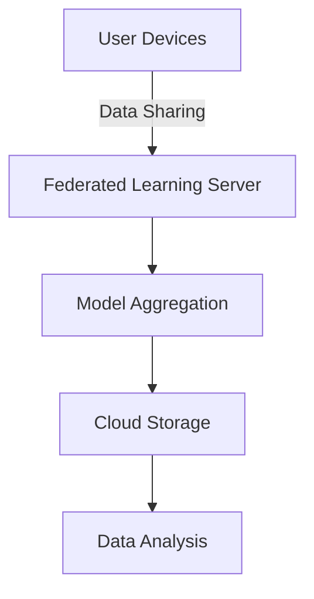

# Operations Documentation for AI-Powered Climate Change Impact Simulation

## Table of Contents
- [Introduction](#introduction)
- [Deployment Procedures](#deployment-procedures)
  - [Infrastructure Overview](#infrastructure-overview)
  - [Deployment Steps](#deployment-steps)
- [Monitoring](#monitoring)
  - [Monitoring Tools](#monitoring-tools)
  - [Key Metrics](#key-metrics)
- [Incident Response](#incident-response)
  - [Incident Identification](#incident-identification)
  - [Incident Management Process](#incident-management-process)
- [Recovery Procedures](#recovery-procedures)
  - [Backup Strategies](#backup-strategies)
  - [Disaster Recovery Plan](#disaster-recovery-plan)
- [Trade-offs and Rationale](#trade-offs-and-rationale)
- [Examples](#examples)
- [Related Documentation](#related-documentation)

## Introduction
This document serves as an operational runbook for the AI-Powered Climate Change Impact Simulation for Urban Infrastructure using Federated Learning. It provides detailed procedures for deployment, monitoring, incident response, and recovery. The goal is to ensure that developers and operations teams can effectively manage the system throughout its lifecycle.

## Deployment Procedures

### Infrastructure Overview
The system architecture is designed to support federated learning across multiple urban infrastructure datasets. The infrastructure consists of:

- **Cloud Services**: AWS or Azure for scalable compute and storage.
- **Federated Learning Framework**: PySyft or TensorFlow Federated for decentralized model training.
- **Data Storage**: S3 buckets or Azure Blob Storage for storing datasets.
- **Containerization**: Docker for packaging applications and Kubernetes for orchestration.



### Deployment Steps
1. **Provision Infrastructure**: Use Terraform scripts to provision cloud resources.
   - Example: `terraform apply -var-file="production.tfvars"`
2. **Containerize Applications**: Build Docker images for the simulation and federated learning components.
   - Example: `docker build -t climate-simulation:latest .`
3. **Deploy to Kubernetes**: Use Helm charts to deploy applications.
   - Example: `helm install climate-simulation ./charts/climate-simulation`
4. **Configure Networking**: Set up Ingress controllers for external access and service discovery.
5. **Environment Variables**: Ensure all necessary environment variables are set in Kubernetes secrets.

## Monitoring

### Monitoring Tools
- **Prometheus**: For collecting metrics from the application.
- **Grafana**: For visualizing metrics and creating dashboards.
- **ELK Stack**: For logging and monitoring application logs.

### Key Metrics
- **Model Training Time**: Time taken for federated learning iterations.
- **Data Transfer Rates**: Amount of data transferred between nodes.
- **Error Rates**: Frequency of errors during model training and data processing.
- **System Resource Utilization**: CPU, memory, and disk usage metrics.

## Incident Response

### Incident Identification
- **Automated Alerts**: Set up alerts in Prometheus for key metrics exceeding thresholds.
- **Log Monitoring**: Use ELK Stack to identify anomalies in application logs.

### Incident Management Process
1. **Initial Triage**: Assess the severity and impact of the incident.
2. **Notification**: Inform relevant stakeholders via Slack or email.
3. **Investigation**: Use logs and metrics to diagnose the issue.
4. **Resolution**: Implement a fix and verify the resolution.
5. **Post-Incident Review**: Document the incident and lessons learned.

## Recovery Procedures

### Backup Strategies
- **Regular Backups**: Schedule daily backups of critical data using AWS Backup or Azure Backup.
- **Version Control**: Use Git for versioning code and configuration files.

### Disaster Recovery Plan
1. **Identify Critical Components**: List all critical services and their dependencies.
2. **Failover Procedures**: Define procedures for switching to backup systems in case of failure.
3. **Testing**: Regularly test the disaster recovery plan to ensure effectiveness.

## Trade-offs and Rationale
- **Federated Learning vs. Centralized Learning**: Federated learning enhances privacy and reduces data transfer costs but may lead to slower convergence times due to decentralized data.
- **Cloud vs. On-Premises**: Cloud solutions offer scalability and reduced maintenance overhead, while on-premises solutions provide more control over data security.

## Examples
- **Deployment Example**: To deploy the application, run the following command:
  ```bash
  kubectl apply -f deployment.yaml
  ```
- **Monitoring Setup**: To set up Prometheus monitoring, include the following configuration in your `prometheus.yml`:
  ```yaml
  scrape_configs:
    - job_name: 'climate-simulation'
      static_configs:
        - targets: ['climate-simulation-service:8080']
  ```

## Related Documentation
- [Architecture Overview](docs/ARCHITECTURE.md)
- [Development Guidelines](docs/DEVELOPMENT.md)
- [Security Best Practices](docs/SECURITY.md)
- [Testing Procedures](docs/TESTING.md)

This document is intended to be a living document. As the system evolves, so too should the operational procedures and guidelines. Regular reviews and updates are essential to maintain operational excellence.