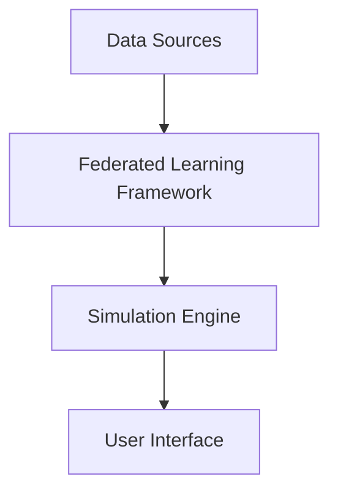

# AI-Powered Climate Change Impact Simulation for Urban Infrastructure Using Federated Learning

## Table of Contents
- [Introduction](#introduction)
- [Architecture Overview](#architecture-overview)
- [Key Components](#key-components)
  - [Data Sources](#data-sources)
  - [Federated Learning Framework](#federated-learning-framework)
  - [Simulation Engine](#simulation-engine)
  - [User Interface](#user-interface)
- [Data Flow](#data-flow)
- [Trade-offs and Rationale](#trade-offs-and-rationale)
- [Security and Privacy Considerations](#security-and-privacy-considerations)
- [Future Work](#future-work)
- [Related Documentation](#related-documentation)

## Introduction
The AI-Powered Climate Change Impact Simulation for Urban Infrastructure project aims to leverage federated learning to simulate the impacts of climate change on urban infrastructure. By utilizing decentralized data sources, we can create a robust model that respects user privacy while providing valuable insights for urban planners and policymakers.

## Architecture Overview
The architecture is designed to facilitate a seamless interaction between various components, ensuring scalability, maintainability, and performance. The system is divided into four primary components:

1. **Data Sources**: Collects and preprocesses data from various urban infrastructure sensors and climate models.
2. **Federated Learning Framework**: Manages the training of machine learning models across distributed data sources without centralizing sensitive information.
3. **Simulation Engine**: Runs simulations based on the trained models to predict climate change impacts.
4. **User Interface**: Provides an interactive platform for users to visualize simulation results and insights.

## Key Components

### Data Sources
Data is collected from various urban infrastructure sensors, climate models, and historical datasets. The data sources include:
- **IoT Sensors**: Collect real-time data on temperature, humidity, air quality, and infrastructure status.
- **Climate Models**: Provide projections of climate change scenarios.
- **Historical Data**: Includes past climate data and infrastructure performance metrics.

**Decision**: Using diverse data sources enhances the model's accuracy and robustness. However, it requires careful data preprocessing to ensure compatibility and quality.

### Federated Learning Framework
The federated learning framework allows for decentralized model training. Key features include:
- **Client-Server Architecture**: Each data source acts as a client that trains a local model and shares only model updates with a central server.
- **Aggregation Mechanism**: The server aggregates model updates using techniques like Federated Averaging to create a global model.

**Example**: If a city has multiple sensors, each sensor can train a model locally on its data and send the updates to the server, which then combines these updates to improve the global model.

### Simulation Engine
The simulation engine utilizes the trained models to run climate impact simulations. It includes:
- **Scenario Management**: Users can define various climate scenarios to simulate.
- **Result Generation**: Outputs predictions on infrastructure performance under different climate conditions.

**Decision**: The simulation engine is designed to be modular, allowing for easy integration of new models or scenarios as they become available.

### User Interface
The user interface is designed for ease of use, providing:
- **Interactive Dashboards**: Visualize simulation results and insights.
- **Scenario Configuration**: Users can easily configure and run different climate scenarios.

**Trade-off**: While a rich user interface enhances user experience, it requires additional development resources and testing to ensure usability.

## Data Flow
The data flow within the system is designed to minimize latency and maximize efficiency. Data is collected from sensors, preprocessed, and sent to the federated learning framework. The framework trains local models, aggregates updates, and sends the global model back to clients. The simulation engine then uses this model to generate results, which are displayed on the user interface.

## Trade-offs and Rationale
- **Decentralization vs. Centralization**: Federated learning allows for privacy preservation but may lead to slower convergence times compared to centralized training. The trade-off is justified by the need for data privacy.
- **Complexity vs. Performance**: The modular design of the simulation engine adds complexity but allows for future scalability and adaptability to new models and scenarios.

## Security and Privacy Considerations
Given the sensitivity of the data involved, security and privacy are paramount. Key measures include:
- **Data Encryption**: All data in transit and at rest is encrypted to prevent unauthorized access.
- **Anonymization**: Data collected from sensors is anonymized to protect user privacy.
- **Access Control**: Role-based access control ensures that only authorized users can access sensitive data.

## Future Work
Future enhancements may include:
- **Integration of Additional Data Sources**: Expanding the range of data inputs to improve model accuracy.
- **Advanced Simulation Features**: Implementing more complex simulation scenarios and predictive analytics.
- **User Feedback Mechanism**: Allowing users to provide feedback on simulation results to refine models further.

## Related Documentation
- [Federated Learning Overview](https://federated-learning.org)
- [Climate Change Impact Models](https://climateimpactmodels.org)
- [Urban Infrastructure Resilience](https://urbanresilience.org)

This documentation serves as a comprehensive guide for developers and stakeholders involved in the AI-Powered Climate Change Impact Simulation project, providing insights into the architecture, design decisions, and future directions.